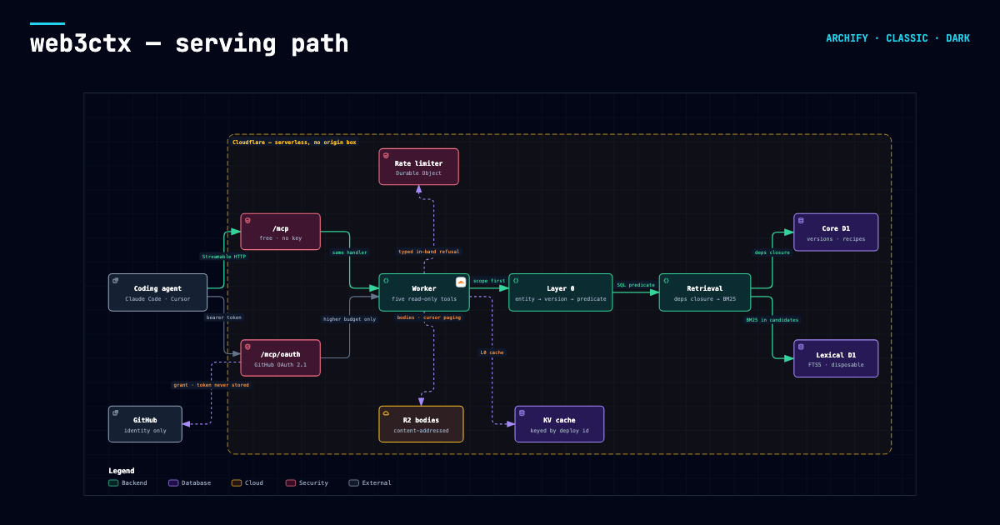

<div align="center">

# web3ctx

### The last mile before your agent signs.

Human-validated, chain-run web3 integration recipes, served version-true over MCP.

     

</div>

## Five tools

| tool | what it does |
|---|---|
| `web3_search` | ranked, version-scoped units — plus the human-validated recipe when the question earns one |
| `web3_grep` | exact identifier lookup across the corpus |
| `web3_fetch` | full bodies by stable selector, cursor paging for long content |
| `web3_deps` | dependency closure, stepped by depth |
| `web3_lookup` | typed records — deployment addresses, ABIs, EIPs — or an honest `NOT_FOUND` |

## A real answer

**“how do I bridge USDC with CCTP”** — one call to the authless endpoint, 2026-08-28:

```json
{
  "intent": "lookup",
  "recipe": {
    "project_id": "cctp",
    "version": "2",
    "recipe_type": "usdc-bridge-send",
    "last_validated": "2026-08-07",
    "validated_by": "farseen (github: FarseenSh)",
    "receipts": {
      "validated_on": "2026-08-07",
      "validated_by": "farseen (github: FarseenSh)",
      "checks": [
        "attest",
        "test"
      ],
      "chains_exercised": [
        "base-sepolia",
        "arbitrum-sepolia"
      ],
      "on_chain": [
        {
          "kind": "txHash",
          "hash": "0xd4b4e6395f52ad726dd6062e7a7ec47a2d3a7875d36f20fbb154cde756a3d0f5",
          "role": "approve",
  // … 207 more lines — the receipts, the
  // validated recipe body, and ten citations each pinned to a commit or an exact package version.
```

The whole response is 26,191 bytes (sha256 `bc58a9feba1f6309…`) and it publishes byte-for-byte: [`evidence/showcase/cctp-search.json`](evidence/showcase/cctp-search.json). Diff it against your own call.

## Why this exists

**It does not get fooled by a wrong premise.** Ten questions built on premises verified false
before the run — an archived repo, a renamed package, a version that does not exist. web3ctx was
deceived **0 of 10**; every other arm was deceived at least once (1–3 of 10).
🔴 Our own `intent=integrate` row was deceived **once**, and it publishes here beside the other:
a stray line in one recipe cited an archived repository.
[The ten traps and every arm’s answer →](evals.html)

**Citations you can re-fetch.** Every unit carries `project@version` and a URL pinned to a
40-character commit: **142 of 144** across the audited payloads, against **~0** for every tool
compared. [The audit protocol →](evals.html)

**When it does not know, it says so.** Asked about eight projects it does not index, it declines
all eight and names what would resolve each one. Competitors answer most of them.
⚠ Zero confabulated rows anywhere, **including ours** — that column separates nobody, and it is
reported rather than claimed as an advantage. [Abstention honesty →](evals.html)

**The recipes are the moat.** Each one was run by a human against live chains and ships with the
transaction receipts, so anyone can check the claim by RPC rather than trusting the stamp.

## Freshness, stated honestly

Every unit carries **`as_of`** — the committer date of the **commit we pinned** — and a citation
that resolves to an immutable, re-fetchable reference. Rebuilds are **dated events**, stamped
into `corpus_version` and visible on the coverage page along with when the index was last
loaded. 🔴 **No refresh cadence is claimed anywhere**, because we could not keep one. A 2020
date on an archived repository is not staleness — it is the newest thing upstream ever
published. [Per-project dates and coverage →](coverage.html)

## Quickstart

```bash
claude mcp add --transport http web3ctx https://mcp.scarai.xyz/mcp
```

```json
{ "mcpServers": { "web3ctx": { "type": "http", "url": "https://mcp.scarai.xyz/mcp" } } }
```

Cursor, Windsurf, Zed and any MCP client: add the same URL — `https://mcp.scarai.xyz/mcp` — as
a remote HTTP server. No key, no signup — the free tier is the read path and always will be.

## How a question is answered

[](https://web3ctx.scarai.xyz/serving-path.html)

**[Open the interactive map →](https://web3ctx.scarai.xyz/serving-path.html)** — hover any
component, trace routes, play the three guided views.

*Resolve entities → bind or **ABSTAIN** the version from evidence → filter by SQL predicate,
rank with BM25 within → budget-true payload, citations before bodies. Deterministic end to
end — no model on the serving path.*

## The evidence

This repository carries every measurement behind the claims above — including the experiments
that failed, the gates we did not clear, and the corrections to things we published wrong.
Competitor payload **bytes** are withheld by rule; their protocol, hashes and counts are all
here, so any count can be re-run against the live tools.

**[Read the evidence →](evidence/README.md)** · [overview](index.html) · [evals](evals.html) · [coverage — is your stack in there?](coverage.html) · [who runs it, and what it logs](operator.html) · [architecture](architecture.html)

Licensed **MIT** (code and site) and **CC BY 4.0** (the evidence documents) — [why there are two](LICENSES.md). Every unit the server returns is an excerpt of a third-party open-source repository, served under **its own** licence with a commit pin.

---

<sub>630 integration projects + 1,193 specification ids (609 ERC + 583 core EIP + 1 in both repos) = 1,823 total · 1,339,786 units · 26 human-stamped recipes.
Every number on this page is read from the live database at publish time; none is typed.</sub>
